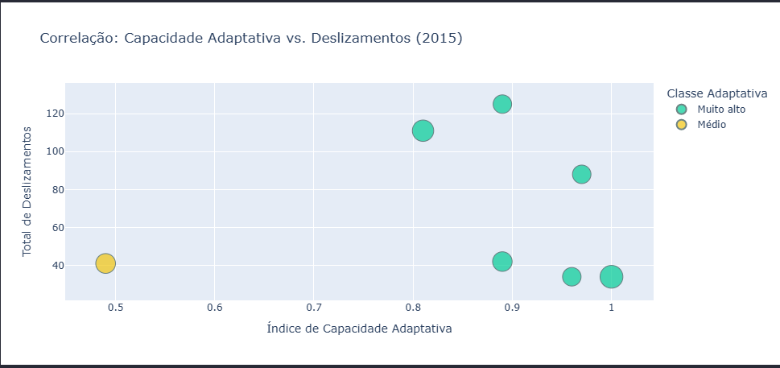
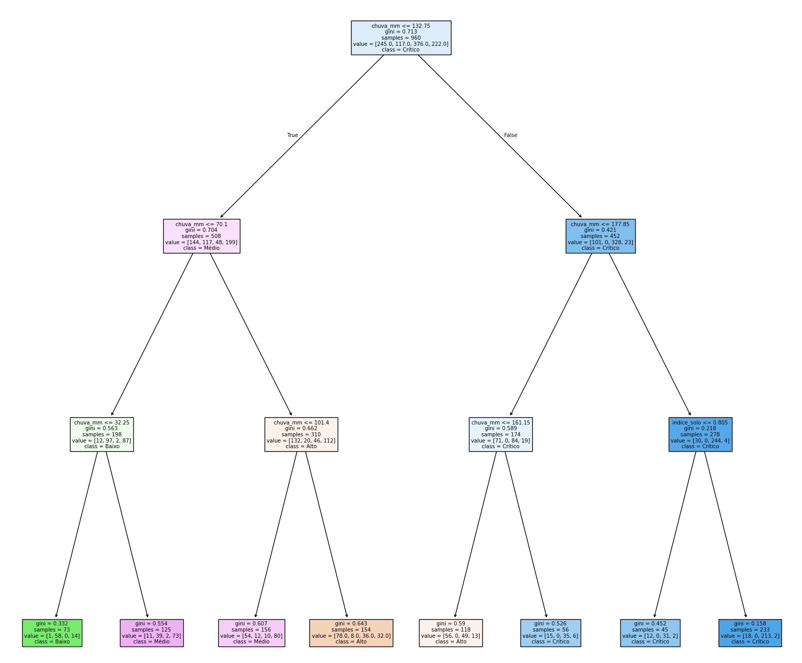
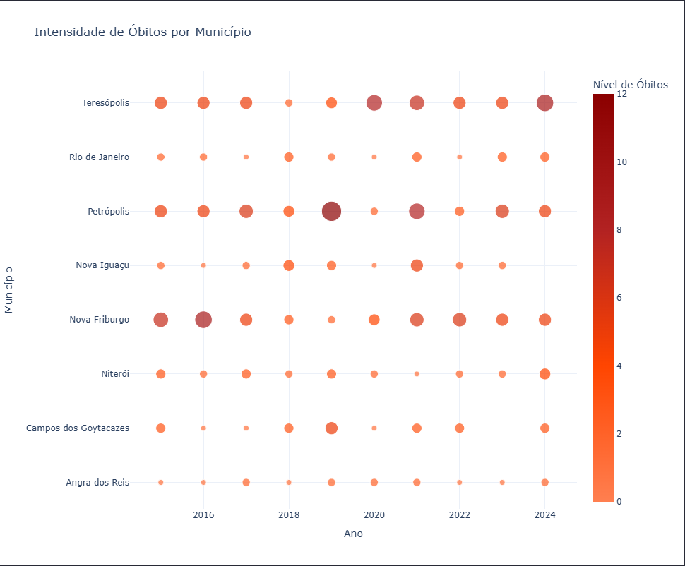
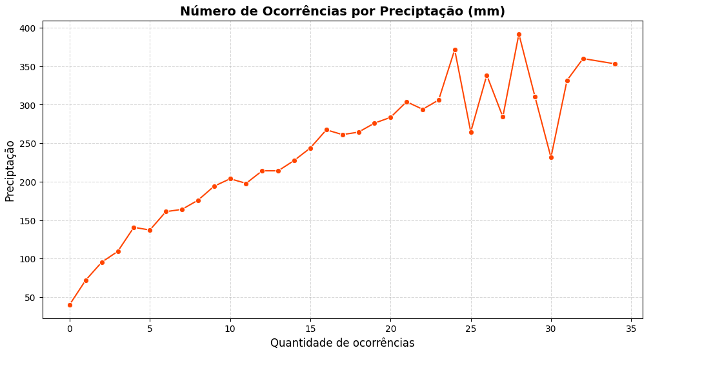

# 📊 GeoRisk: Painel Analítico de Riscos Geológicos

Este projeto foi desenvolvido para a disciplina de **Linguagens de Programação**, sob a orientação do professor **Alexandre Neves Louzada**. O GeoRisk é uma solução focada em **Análise de Dados, Estatística Computacional e Desenvolvimento em Python**, dedicada à modelagem de riscos de deslizamentos no estado do Rio de Janeiro.

---

### 🎯 Sobre o Projeto
O **GeoRisk** foi desenvolvido no âmbito do **Tema 2 — Chuvas e Deslizamentos no Estado do Rio de Janeiro**. A base de dados principal é composta pelo ficheiro `simulacao_chuvas_deslizamentos_rj.csv`, fornecido pelo orientador para o desenvolvimento do sistema. 

Com o objetivo de elevar a robustez técnica e o potencial preditivo da aplicação, tomei a iniciativa de pesquisar e integrar uma fonte externa complementar: a base de dados da **AdaptaBrasil (INPE)**, focada no indicador de *Desastres geo-hidrológicos — Deslizamento de terra — Capacidade adaptativa* ([acesso aos dados aqui](https://data.inpe.br/geonetwork/srv/api/records/adaptabrasil60005)). 

O cruzamento desses dois conjuntos de dados permitiu que a ferramenta não apenas analise o fenómeno meteorológico de forma isolada, mas também contextualize as ocorrências dentro da resiliência e infraestrutura dos municípios, resultando num modelo preditivo cientificamente mais embasado e preciso.

--- 

### ℹ️ Informativos
Pela análise dos dados no **AdaptaBrasil (INPE)**, há informativos sobre:
- **Índice de capacidade adaptativa**: Capacidade do sistema socioecológico de se preparar e se ajustar aos desastres geo-hidrológicos provenientes das alterações climáticas ou danos climáticos potenciais, principalmente para diminuir os impactos negativos, aproveitar as oportunidades ou responder às consequências. No contexto das mudanças climáticas, a adaptação é compreendida como um conjunto de processos de ajustes no sistema, com a finalidade principal de preparar o mesmo para os efeitos das mudanças climáticas e, assim, reduzir as condições de vulnerabilidade a riscos de eventos adversos. O Índice de Capacidade Adaptativa é resultante da composição dos indicadores temáticos: Capacidade de investimento público municipal e renda; Governança e gestão de risco de desastres de deslizamento de terra; e Capacidade municipal em cidadania e políticas setoriais.
- **Investimento per capita em políticas de adaptação e infraestrutura para proteção ambiental**: Valor per capita das transferências governamentais destinadas à proteção ambiental em políticas de adaptação e infraestrutura, considerando a temática de capacidade municipal em investimento e renda. Para composição deste indicador foram considerados todos os tipos de transferências (legais, voluntárias e específicas, além das transferências constitucionais e royalties) realizadas para a administração pública municipal e para o fundo público (denominados como favorecidos), nas áreas de atuação (função): agricultura, educação, gestão ambiental, habitação, organização agrária, reserva de contingência, saneamento, saúde e urbanismo. O indicador foi obtido a partir da razão entre o total dos recursos financeiros repassados aos favorecidos nas funções especificadas acima e a população total. Dados em nível municipal obtidos em Detalhamento das transferências de recursos disponibilizados pelo Portal da Transparência da Controladoria-Geral da União (CGU)

### 🛠️ Stack Tecnológica

- **Streamlit:** Framework de Front-end para renderização de aplicações Web dinâmicas (SPA).
- **Python & Pandas:** Motor principal de processamento lógico e agregação matemática de dados em tempo de execução.
- **Scikit-Learn:** Biblioteca de Machine Learning utilizada para treinamento e execução do modelo de Árvore de Decisão responsável pela classificação preditiva dos níveis de risco.
- **SQLite & SQLAlchemy:** Banco de dados relacional e ORM para abstração e segurança nas integrações lógicas.
- **HTML5 & CSS3:** Customização padrão para aprimorar a interface de usuário e a legibilidade dos dados apresentados.
- **Plotly Express:** Biblioteca de DataViz para renderização de gráficos e mapeamento geográfico interativo.

---

### ✨ Funcionalidades Principais

- [x] Integração e cruzamento de bases de dados distintas
- [x] Modelagem relacional com SQLAlchemy e SQLite
- [x] KPIs dinâmicos e indicadores de impacto
- [x] Dashboards organizados em múltiplas seções
- [x] Aplicação web interativa com Streamlit
- [x] Análise exploratória e visualização de dados
- [x] Aplicação de modelo de árvore de decisão
- [x] Modelo preditivo de Machine Learning para classificação de risco
- [x] Simulador interativo de cenários baseado em Árvore de Decisão

---

### 🏗️ Arquitetura do Sistema

```mermaid
graph TD
    CSV1[CSV: AdaptaBrasil / INPE] --> DB[(SQLite DB)]
    CSV2[CSV: Simulação Deslizamentos] --> DB
    DB --> SQL[SQLAlchemy / ORM]
    SQL --> PANDAS[Pandas: Consolidação & Tratamento]
    PANDAS --> MODEL[Scikit-Learn: Árvore de Decisão]
    PANDAS --> DASH[Streamlit Dashboard]
    MODEL -->|Predição| DASH
    DASH --> USER(Usuário Final)

    style DB fill:#1e293b,stroke:#00d4ff
    style PANDAS fill:#0f172a,stroke:#00d4ff
    style MODEL fill:#0f172a,stroke:#00d4ff
```

---

### 📈 Gráficos do .ipynb
* **Correlação entre Capacidade Adaptativa e Impacto:**
  
* **Estrutura do Modelo Preditivo (Árvore de Decisão):**
  
* **Ranking de Mortalidade por Município:**
  
* **Impacto da Precipitação na Frequência de Ocorrências:**
  

